# LockIn — Sequential Development Phases

> Companion document: [`summary.md`](./summary.md)  
> Delivery model: Strictly sequential phase gates  
> MVP platform: Windows 10/11  
> Stack: Electron + React + TypeScript + Vite + Tailwind CSS

## 1. How This Plan Works

Development follows one rule:

> A phase may start only after every exit criterion in the previous phase has passed and its evidence has been recorded.

Only one phase may be `IN PROGRESS` at a time. Later phases remain `BLOCKED BY DEPENDENCY`, even if some of their work appears easy to begin early. This prevents visual polish, packaging, or secondary features from hiding an unresolved browser, security, timer, or recovery problem.

### Phase statuses

| Status | Meaning |
|---|---|
| `NOT STARTED` | Its dependency is incomplete or work has not begun |
| `IN PROGRESS` | The only phase currently being implemented |
| `BLOCKED` | Work started but a documented issue prevents its exit gate |
| `DONE` | Every required step, test, artifact, and exit criterion passed |

### Gate evidence

Before a phase becomes `DONE`, record:

- the commit or version tested;
- completed checklist;
- automated test results where applicable;
- manual test notes and screenshots where applicable;
- known limitations accepted for the MVP; and
- the explicit pass/fail result for the phase gate.

“Code exists” is not sufficient. The phase must work as specified.

## 2. Phase Map

```mermaid
flowchart LR
    P0[0. Product Baseline] --> P1[1. Feasibility Spike]
    P1 --> P2[2. Production Foundation]
    P2 --> P3[3. UI System and Static Flow]
    P3 --> P4[4. Local Data and Presets]
    P4 --> P5[5. Session Engine and Timer]
    P5 --> P6[6. Embedded Website Workspace]
    P6 --> P7[7. Navigation and Browser Security]
    P7 --> P8[8. Focus Mode and Recovery]
    P8 --> P9[9. Product Integration and Polish]
    P9 --> P10[10. Release QA and Hardening]
    P10 --> P11[11. Packaging and Release]
```



| Phase | Outcome | Depends on |
|---|---|---|
| 0 | Product and technical decisions are frozen | None |
| 1 | Critical websites work inside Electron | Phase 0 |
| 2 | Secure production project foundation exists | Phase 1 |
| 3 | Complete static product flow is visually approved | Phase 2 |
| 4 | Websites and presets persist safely | Phase 3 |
| 5 | Session state and timer are reliable | Phase 4 |
| 6 | One controlled website opens inside LockIn | Phase 5 |
| 7 | Outside navigation and unsafe browser behavior are blocked | Phase 6 |
| 8 | Fullscreen lifecycle, emergency exit, and recovery work | Phase 7 |
| 9 | The entire product is cohesive, accessible, and smooth | Phase 8 |
| 10 | Release candidate passes the test matrix | Phase 9 |
| 11 | A verified Windows installer is produced | Phase 10 |

---

## Phase 0 — Product and Architecture Baseline

**Status:** `DONE`
**Purpose:** Prevent the scope and stack from changing during implementation without an explicit decision.

### Required decisions

- [x] Product is a Windows desktop application.
- [x] Focus mode is fullscreen and kiosk-styled.
- [x] Users choose duration and allowed websites before starting.
- [x] Allowed websites appear as circular launcher cards.
- [x] One website is active at a time.
- [x] Websites open inside LockIn, not in Firefox or another external browser.
- [x] Stack is Electron, React, TypeScript, Vite, and Tailwind CSS.
- [x] Persistence is local JSON; there is no database or backend.
- [x] MVP prevents casual distraction, not determined OS-level bypass.
- [x] C#, WPF, Firefox policies, Windows services, and separate Windows accounts are out of scope.

### Required artifacts

- `summary.md` containing the locked product and technical design.
- `phase.md` containing this sequential delivery plan.
- A short decision log entry for any later change to a checked decision.

### Exit gate

Phase 0 passes when the product owner approves both documents and no open decision changes the feasibility spike.

**Gate result:** Approved through the product discussion; implementation has not started.

---

## Phase 1 — Embedded Website Feasibility Spike

**Status:** `DONE`  
**Depends on:** Phase 0 `DONE`  
**Purpose:** Prove the riskiest assumption before investing in the complete interface.

### Step 1.1 — Create a disposable Electron experiment

- Create a minimal Electron application in a temporary or clearly isolated spike folder.
- Open a single `BrowserWindow`.
- Reserve a fixed top area representing the future LockIn navigation bar.
- Attach one `WebContentsView` below the top area.
- Enable Chromium sandboxing and disable Node integration for remote content from the beginning.

### Step 1.2 — Test the three reference websites

Test the latest production versions of:

- LeetCode;
- ChatGPT; and
- Canva.

For each website, verify:

- initial page load;
- sign-in and sign-out;
- keyboard and mouse input;
- cookies surviving a view recreation and app restart;
- redirects;
- links requesting a new window;
- clipboard behavior;
- file upload if essential to the website;
- normal page performance; and
- meaningful error behavior when offline.

### Step 1.3 — Identify authentication dependencies

- Record every additional top-level hostname required by Google, Microsoft, or site-specific authentication.
- Distinguish login-only supporting hosts from normal session hosts.
- Confirm that returning from authentication to the selected website works.
- Do not solve the final navigation policy yet; this step only identifies requirements.

### Step 1.4 — Validate the single-view strategy

- Load each reference website sequentially in one view.
- Measure approximate Task Manager memory after each load.
- Confirm that destroying or replacing the view releases memory within a reasonable period.
- Confirm that the React/UI area can remain visible while website content occupies the rest of the window.

### Deliverables

- Runnable spike.
- Compatibility table for LeetCode, ChatGPT, and Canva.
- List of authentication/supporting domains.
- Memory observations.
- Written decision for any site that cannot support an essential flow.

### Exit gate

Phase 1 passes only if:

- all three reference sites render and their essential workflows are usable;
- authentication pages render and the persistent browser session survives view and application restarts;
- LockIn-owned UI can remain visible above `WebContentsView`;
- one view can be created, replaced, and destroyed reliably; and
- no discovered limitation invalidates the approved product experience.

Provider-specific credential flows are validated in Phase 7 because they require user-owned credentials and final navigation rules. The accepted embedded-OAuth limitation is recorded in ADR-002.

If a critical site fails to render, Phase 1 remains `BLOCKED`. Resolve the issue or formally revise Phase 0 before continuing.

---

## Phase 2 — Production Project Foundation

**Status:** `DONE`
**Depends on:** Phase 1 `DONE`  
**Purpose:** Create the secure, maintainable project that will become the actual product.

### Step 2.1 — Scaffold the project

- Create the production Electron + React + TypeScript project using a Vite-based Electron template.
- Separate `main`, `preload`, and `renderer` source folders.
- Pin dependency versions and commit the lockfile.
- Add development, typecheck, lint, test, build, and start scripts.
- Establish a supported Node.js version in an engine or version file.

### Step 2.2 — Establish code quality

- Enable strict TypeScript.
- Configure ESLint and formatting.
- Configure path aliases only if they reduce real import noise.
- Add Vitest and React Testing Library.
- Add a minimal smoke test for each process boundary.
- Ensure one command can run all non-E2E checks.

### Step 2.3 — Establish process boundaries

- Keep filesystem and Electron APIs in the main process.
- Enable `contextIsolation` and sandboxing.
- Disable renderer Node integration.
- Create a minimal typed preload bridge.
- Validate every IPC input in the main process with Zod.
- Do not expose generic file, shell, URL, or command APIs.

### Step 2.4 — Create the application shell

- Open one normal development window.
- Add renderer routing or an explicit screen state model.
- Add a global error boundary.
- Add structured development logging without browsing data.
- Define paths for user data, logs, and cached website icons.

### Step 2.5 — Add continuous verification

- Configure a Windows CI job for install, typecheck, lint, unit tests, and build.
- Confirm a clean checkout can be built from documented commands.
- Make the build fail on type or test errors.

### Deliverables

- Production repository scaffold.
- Secure preload and IPC skeleton.
- Passing quality scripts and Windows CI.
- Development README with setup and run instructions.

### Exit gate

Phase 2 passes when a clean checkout installs, typechecks, tests, builds, and opens successfully on Windows with no direct Node.js access from the React renderer.

**Gate result:** `PASS` — see [`docs/phase-2-handoff.md`](./docs/phase-2-handoff.md).

---

## Phase 3 — Design System and Static Product Flow

**Status:** `IN PROGRESS`
**Depends on:** Phase 2 `DONE`  
**Purpose:** Approve the complete visual and interaction direction before connecting business logic.

### Step 3.1 — Define the visual foundation

- Choose the primary font with a safe offline fallback.
- Define background, surface, text, border, accent, success, warning, and error colors.
- Define spacing, radii, shadows, focus rings, and motion durations as tokens.
- Configure Tailwind around those tokens.
- Establish minimum contrast and reduced-motion rules.

### Step 3.2 — Build reusable UI primitives

- Button variants.
- Duration selector.
- Text and URL input.
- Dialog and confirmation panel.
- Circular website card.
- Countdown display.
- Top navigation bar.
- Empty, loading, error, and blocked states.
- Toast or inline feedback only where necessary.

### Step 3.3 — Build static screens

- Home/setup.
- Add and edit website dialog.
- Pre-session review.
- Focus launcher.
- Website shell with top bar.
- Blocked navigation.
- Emergency exit.
- Session complete.

### Step 3.4 — Connect a mocked walkthrough

- Navigate through every screen using sample data.
- Use LeetCode, ChatGPT, and Canva as example cards.
- Include keyboard focus behavior.
- Verify 100%, 125%, 150%, and 200% Windows scaling.
- Verify the intended minimum supported screen size.

### Deliverables

- Tokenized design system.
- Reusable core components.
- Complete mocked user journey.
- Screenshots of every required state.

### Exit gate

Phase 3 passes when the full mocked journey is visually approved, keyboard-navigable, readable at supported scaling levels, and contains every state needed by later implementation.

No persistence, timer, or browser integration is required in this phase.

---

## Phase 4 — Local Data, Website Management, and Presets

**Initial status:** `NOT STARTED`  
**Depends on:** Phase 3 `DONE`  
**Purpose:** Replace sample data with safe local configuration.

### Step 4.1 — Define and validate models

- Define `Space`, `Preset`, `AppSettings`, and persisted-state schemas.
- Give every persisted schema a version.
- Reject invalid HTTPS URLs, unsafe protocols, and malformed hosts.
- Normalize hosts using the platform URL parser.
- Define exact subdomain matching semantics.

### Step 4.2 — Implement the main-process store

- Store data beneath Electron's Windows `userData` directory.
- Keep all reads and writes in the main process.
- Write changes atomically so a crash cannot leave half-written JSON.
- Create a safe default if data is missing.
- Quarantine corrupted data and display a recoverable message.
- Add a migration path for future schema versions.

### Step 4.3 — Implement website management

- Add, edit, delete, and reorder spaces.
- Generate a default display name from the hostname.
- Fetch or derive a favicon without blocking the form.
- Allow a custom local icon and accent color.
- Warn about duplicate or overlapping host rules.
- Provide a test/open action outside focus mode.

### Step 4.4 — Implement presets

- Create, rename, update, duplicate, and delete a preset.
- Save duration and ordered spaces.
- Require at least one space and a valid positive duration.
- Confirm destructive preset deletion.

### Required tests

- URL normalization and hostile hostname cases.
- Exact-host and subdomain matching.
- Round-trip persistence.
- Atomic-write recovery.
- Missing, invalid, and old-version data.
- CRUD flows for spaces and presets.

### Exit gate

Phase 4 passes when a user can create a preset, restart LockIn, and retrieve exactly the same validated duration, website order, host rules, names, colors, and icons without renderer filesystem access.

---

## Phase 5 — Session Engine and Reliable Timer

**Initial status:** `NOT STARTED`  
**Depends on:** Phase 4 `DONE`  
**Purpose:** Make the session lifecycle correct before it controls fullscreen or browser content.

### Step 5.1 — Define the state machine

Use explicit states:

```text
idle → preparing → active → completing → completed
                    └──────→ abandoning → abandoned
```

- Reject invalid transitions.
- Allow only one active session.
- Snapshot the preset so later preset edits cannot alter an active session.
- Give completion and abandonment distinct reasons.

### Step 5.2 — Implement authoritative timing

- Create `startedAtUtc` and `endsAtUtc` in the main process.
- Use a monotonic clock for elapsed time while running.
- Derive displayed seconds from the authoritative deadline; do not decrement a counter blindly.
- Send renderer updates no more than once per second.
- Complete at zero even if renderer animation is delayed.

### Step 5.3 — Persist active sessions

- Write the session before entering `active`.
- Persist its original deadline and preset snapshot.
- On app launch, determine whether it is active, overdue, completed, or invalid.
- Never extend the deadline during restart or resume.
- Clear active state only after completion/abandonment is durable.

### Step 5.4 — Connect timer screens

- Start from pre-session review.
- Display the timer in launcher and website-shell mock screens.
- Transition to completion automatically.
- Add minimal completed/abandoned history.

### Required tests

- Normal completion.
- Renderer pause or reload.
- Event-loop delay.
- Sleep/resume simulation.
- App restart before and after deadline.
- Manual wall-clock change behavior.
- Duplicate Start commands.
- Invalid state transitions.

### Exit gate

Phase 5 passes when a session deadline cannot be reset or extended accidentally, completion occurs exactly once, and restart reconstruction passes every required timer test.

---

## Phase 6 — Embedded Website Workspace

**Initial status:** `NOT STARTED`  
**Depends on:** Phase 5 `DONE`  
**Purpose:** Replace the mocked website panel with one real controlled browser view.

### Step 6.1 — Implement `WebContentsView` ownership

- Let the main process create, size, show, hide, and destroy the view.
- Position it below the LockIn top bar.
- Recalculate bounds on window resize, display scaling, and monitor changes.
- Guarantee no more than one active website view.
- Keep the React top bar and countdown visible.

### Step 6.2 — Connect launcher actions

- Send `openSpace(spaceId)` through typed IPC.
- Resolve the ID from the active preset snapshot in the main process.
- Load only the stored start URL; never accept an arbitrary renderer URL.
- Show loading, success, failure, and offline states.
- Make **Spaces** dispose of or unload the view and return to the launcher.

### Step 6.3 — Configure website sessions

- Use one named persistent Electron partition for website cookies.
- Verify sign-in survives LockIn restart.
- Add a settings action to clear website data.
- Ensure clearing data cannot occur silently during an active session.

### Step 6.4 — Validate resource use

- Switch repeatedly among the three reference sites.
- Confirm old views do not accumulate.
- Record Task Manager memory before and after each switch.
- Verify a crashed website renderer produces a recoverable error screen, not an app crash.

### Exit gate

Phase 6 passes when each launcher card opens its real website below the persistent LockIn top bar, returning to Spaces works, logins persist, and repeated switching never leaves multiple active website views.

---

## Phase 7 — Navigation Control and Browser Security

**Initial status:** `NOT STARTED`  
**Depends on:** Phase 6 `DONE`  
**Purpose:** Ensure remote websites stay inside their approved boundary and cannot reach privileged Electron capabilities.

### Step 7.1 — Implement hostname policy

- Allow HTTPS by default; reject unsafe protocols.
- Compare parsed, normalized hostnames.
- Support exact-host rules.
- Support subdomains only when explicitly enabled and with a dot boundary.
- Treat authentication/supporting hosts as explicit rules.
- Keep top-level navigation rules separate from subresource loading.

### Step 7.2 — Cover every navigation path

- Initial load.
- User link navigation.
- Server and client redirects.
- Form submission.
- `window.open` and target `_blank`.
- Pop-ups.
- External protocols.
- History back/forward behavior.

Allowed new-window destinations open in the controlled view. Disallowed destinations are cancelled and produce the designed blocked state.

### Step 7.3 — Lock remote-content privileges

- Keep `nodeIntegration: false`.
- Keep `contextIsolation: true`.
- Keep `sandbox: true`.
- Do not attach the LockIn preload API to website views.
- Deny permission requests unless a documented feature requires one.
- Deny downloads for MVP unless a reference-site workflow proves they are essential.
- Disable DevTools for remote views in production.
- Prevent remote pages from navigating the LockIn renderer.

### Step 7.4 — Test adversarial cases

- `leetcode.com.evil.example`.
- Username/password URL tricks.
- Unicode and punycode hostnames.
- Mixed-case and trailing-dot hosts.
- Non-HTTPS protocols.
- Redirect chains ending outside the allowlist.
- JavaScript pop-ups and repeated window requests.
- Malformed IPC payloads and unknown space IDs.

### Exit gate

Phase 7 passes when all legitimate reference-site and sign-in flows work, every tested outside-navigation path is blocked, and remote pages have no Node.js, preload, filesystem, shell, or unrestricted IPC access.

Security failures block all later work.

---

## Phase 8 — Fullscreen Focus Mode, Exit Handling, and Recovery

**Initial status:** `NOT STARTED`  
**Depends on:** Phase 7 `DONE`  
**Purpose:** Turn the working session into the intended focused desktop experience without creating unsafe lockout behavior.

### Step 8.1 — Enter focus mode

- Complete preflight before changing the window.
- Persist the active session first.
- Make the window borderless and fullscreen/kiosk-styled.
- Remove ordinary minimize, maximize, and close controls.
- Bring the launcher into focus.
- Prevent duplicate focus windows.

### Step 8.2 — Handle ordinary exit attempts

- Cancel normal close events during an active session.
- Intercept common accidental shortcuts where Electron and Windows safely permit it.
- Return focus to LockIn after ordinary focus loss where reasonable.
- Do not claim or attempt unsafe prevention of `Ctrl + Alt + Delete`, Task Manager, sign-out, restart, or administrator action.

### Step 8.3 — Implement emergency exit

- Reveal it only through the approved shortcut.
- Require a ten-second hold.
- Require the exact confirmation phrase.
- Mark the session `abandoned` before leaving focus mode.
- Ensure it remains keyboard and screen-reader accessible.

### Step 8.4 — Implement normal completion

- Stop new browser navigation at zero.
- Destroy the active website view.
- Mark the session completed.
- Exit fullscreen.
- Show completion once.
- Preserve the preset and website login data.

### Step 8.5 — Implement recovery

- On launch, inspect durable active-session state.
- Complete an overdue session immediately.
- Resume a still-active session with the original deadline.
- Handle missing, corrupted, or contradictory state safely.
- Verify recovery after renderer reload, main-process crash, and Windows restart followed by reopening LockIn.

### Exit gate

Phase 8 passes when normal close attempts do not casually end a session, normal completion and emergency exit both clean up correctly, and every tested interruption resumes or completes without extending the original deadline or trapping the user.

---

## Phase 9 — End-to-End Product Integration and Polish

**Initial status:** `NOT STARTED`  
**Depends on:** Phase 8 `DONE`  
**Purpose:** Turn the functional system into a cohesive daily-use product.

### Step 9.1 — Complete the real user journey

- First-run explanation.
- Preset creation and editing.
- Test-and-sign-in workflow.
- Pre-session review.
- Launcher, website use, switching, and blocking.
- Normal completion and reuse.
- Emergency exit and interrupted-session messaging.

### Step 9.2 — Polish visual behavior

- Add short launcher, card, browser, and completion transitions.
- Restrict motion to performant properties.
- Respect reduced-motion settings.
- Add intentional loading skeletons or progress states.
- Add clear offline, certificate, crashed-page, and unavailable-site states.
- Prevent layout shifts when favicons load.

### Step 9.3 — Accessibility

- Complete keyboard navigation.
- Add logical focus order and visible focus rings.
- Label every icon-only control.
- Announce important timer and blocked-navigation state without excessive interruptions.
- Verify contrast and text scaling.
- Ensure emergency exit is accessible without being easy to trigger accidentally.

### Step 9.4 — Performance

- Measure cold start and launcher responsiveness.
- Profile React re-renders during countdown.
- Verify one-second timer updates do not rerender the website view.
- Check for leaked views/listeners during repeated switching.
- Record memory for each reference site and after returning to launcher.
- Remove dependencies that add weight without product value.

### Exit gate

Phase 9 passes when the complete journey works without developer tools, visual states are approved, core actions are keyboard accessible, animations remain smooth, and no material view or listener leak appears during repeated sessions.

---

## Phase 10 — Release QA and Hardening

**Initial status:** `NOT STARTED`  
**Depends on:** Phase 9 `DONE`  
**Purpose:** Prove the release candidate across realistic Windows conditions.

### Step 10.1 — Complete automated coverage

- Domain normalization and allowlist unit tests.
- Session state-machine and timer tests.
- Persistence and migration tests.
- IPC schema and authorization tests.
- React interaction tests.
- Electron end-to-end happy path.
- Blocked navigation and recovery end-to-end tests.

### Step 10.2 — Execute the Windows matrix

Test supported Windows 10 and 11 environments across:

- standard and administrator users;
- one and multiple monitors;
- 100%, 125%, 150%, and 200% scaling;
- common laptop and desktop resolutions;
- sleep, hibernate, restart, and clock change;
- online, offline, slow, and interrupted connectivity;
- fresh and previously authenticated website sessions; and
- low-memory pressure while one heavy site is open.

### Step 10.3 — Run failure testing

- Kill the website renderer.
- Reload the React renderer.
- Force-close the main process.
- Corrupt each local JSON file.
- Remove cached icons.
- Interrupt a write.
- Restart before and after the deadline.
- Trigger redirect loops and repeated pop-ups.

### Step 10.4 — Review privacy and security

- Confirm no browsing history is logged.
- Confirm logs omit credentials, query secrets, and page content.
- Confirm remote content has no privileged API access.
- Audit Electron security warnings.
- Run dependency vulnerability and license checks.
- Document accepted MVP limitations.

### Release-blocking severity

- **Critical:** privilege exposure, unsafe navigation escape, data loss, or unrecoverable focus mode.
- **High:** timer reset/extension, broken completion, major reference site unusable, or consistent crash.
- **Medium:** recoverable workflow, accessibility, or layout defect.
- **Low:** cosmetic issue with a clear workaround.

Critical and high issues must be zero. Accepted medium and low issues require written rationale.

### Exit gate

Phase 10 passes only when the full matrix is recorded, all required automated checks pass, critical/high defects are zero, and one frozen release-candidate commit is approved for packaging.

---

## Phase 11 — Windows Packaging and Release

**Initial status:** `NOT STARTED`  
**Depends on:** Phase 10 `DONE`  
**Purpose:** Produce and verify the end-user application without changing product behavior after QA.

### Step 11.1 — Configure production packaging

- Use one chosen packager consistently; prefer `electron-builder` for the MVP.
- Produce an x64 Windows installer first.
- Set application ID, publisher, version, icon, and metadata.
- Create Start Menu and optional desktop shortcuts.
- Keep presets and website sessions in the user-data directory across upgrades.
- Define uninstall behavior clearly.

### Step 11.2 — Configure production behavior

- Disable DevTools and development menus.
- Remove source maps from public artifacts unless intentionally retained and protected.
- Use production logging levels.
- Verify sandbox and IPC security settings in the packaged build.
- Include licenses and required notices.

### Step 11.3 — Install on a clean Windows machine

- Install without development tools present.
- Open from Start Menu and desktop shortcut.
- Complete a real session using all reference sites.
- Restart Windows during an active session and reopen LockIn.
- Upgrade over a previous build and verify data remains.
- Uninstall and confirm binaries are removed.
- Record SmartScreen behavior.

### Step 11.4 — Prepare release artifacts

- Installer executable.
- SHA-256 checksum.
- Versioned release notes.
- Known limitations.
- Basic install, update, recovery, and uninstall instructions.
- Test evidence referencing the exact artifact hash.

For a private/local alpha, an unsigned installer may be accepted with a documented Windows warning. Code signing is required before claiming a polished public release.

### Final release gate

Phase 11 passes when the exact installer artifact installs and completes the core journey on a clean Windows machine, its checksum and test evidence are recorded, and no code changes occurred after the Phase 10 release-candidate approval without repeating affected gates.

---

## 3. Mandatory Phase Handoff Template

Copy this block when closing each phase:

```md
## Phase N Handoff

- Status: DONE / BLOCKED
- Commit:
- Date:
- Implemented:
- Automated checks:
- Manual checks:
- Evidence/screenshots:
- Known limitations:
- Exit criteria result:
- Approved by:
- Next phase unlocked: Yes / No
```

If `Next phase unlocked` is `No`, the next phase must not begin.

## 4. Final MVP Success Scenario

The complete plan succeeds when a clean Windows installation can perform this exact scenario:

1. Open LockIn.
2. Create a 50-minute preset containing LeetCode, ChatGPT, and Canva.
3. Sign in and confirm each site works.
4. Start the session and enter fullscreen.
5. Open each space from its circular card, one at a time.
6. Attempt to navigate to an unapproved site and receive the blocked screen.
7. Return to the launcher without leaving LockIn.
8. Sleep and resume without resetting the deadline.
9. Reach zero and leave focus mode automatically.
10. Reopen LockIn and reuse the saved preset and website logins.

Only after that scenario passes in the packaged installer is the LockIn MVP complete.
