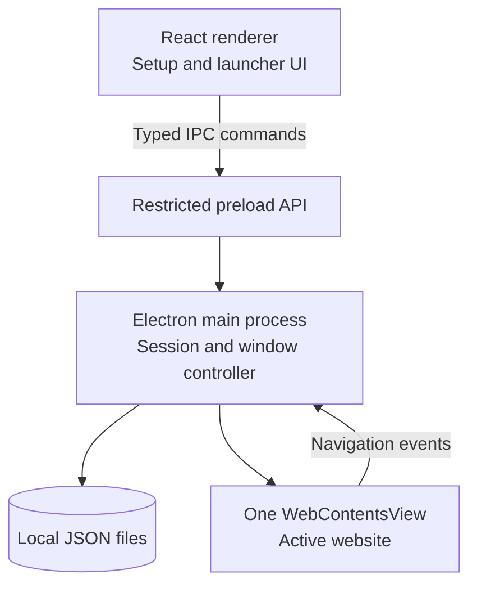

# LockIn — Locked Product and Technical Plan

> Status: MVP direction approved  
> Target: Windows desktop  
> Product: Fullscreen focus launcher with an embedded browser  
> Stack: Electron + React + TypeScript + Tailwind CSS

## 1. Final Product Decision

LockIn is a local-first Windows desktop application. The user chooses a session duration and allowed websites, then starts a focus session. LockIn becomes fullscreen and shows the websites as circular launcher cards. Selecting a card opens that website inside LockIn. Other top-level website navigation is blocked. When the timer ends, LockIn leaves focus mode and returns to setup.

The MVP is deliberately simple. It is **not**:

- a Firefox extension or Firefox-based application;
- a WPF or C# application;
- a Windows service or separate Windows account;
- a cloud application; or
- a security-grade Windows kiosk.

The goal is to prevent casual distraction with a polished experience, not to make bypass technically impossible for a determined Windows user.

## 2. Core User Flow

```text
Open LockIn
    ↓
Choose duration and allowed websites
    ↓
Press Start
    ↓
LockIn enters fullscreen focus mode
    ↓
Circular website launchers appear
    ↓
Open one allowed website inside LockIn
    ↓
Return to launcher and switch website when needed
    ↓
Timer reaches zero
    ↓
LockIn exits focus mode and shows completion
```

That is the complete MVP. Application allowlisting, Firefox policies, Windows account management, and OS-level kiosk configuration are outside the initial scope.

## 3. Product Principles

1. **Easy to use** — duration, websites, Start. No complicated setup.
2. **Beautiful and calm** — intentional, spacious, and distraction-free.
3. **Local-first** — presets and session state stay on the device.
4. **One active space** — only one embedded website runs at a time to control memory use.
5. **Honest enforcement** — fullscreen discourages ordinary exit but is not an OS security boundary.
6. **Safe recovery** — a crash or restart must not permanently trap the user.

## 4. MVP Scope

### Included

- Windows installer and desktop shortcut.
- Duration presets and custom duration.
- Add, edit, remove, and reorder allowed websites.
- Website name, URL, color, and circular logo.
- Fullscreen focus launcher.
- One embedded website active at a time.
- Persistent countdown.
- Top-level navigation allowlist.
- Back-to-launcher control.
- Session completion screen.
- Deliberate emergency exit.
- Local presets and minimal session history.
- Recovery after LockIn closes unexpectedly.

### Excluded

- Allowing or blocking other Windows applications.
- Firefox integration or browser extensions.
- Multiple tabs or simultaneous website views.
- A separate `LockIn Focus` Windows account.
- Task Manager, `Ctrl + Alt + Delete`, sign-out, or restart prevention.
- Accounts, sync, telemetry, subscriptions, or a backend.
- Mobile, macOS, and Linux releases.
- Website activity tracking or browsing-history collection.

## 5. Screen Design

### 5.1 Home and setup

```text
┌────────────────────────────────────────────┐
│ LockIn                                     │
│                                            │
│ What are you locking in for?               │
│                                            │
│ [ 25 min ] [ 50 min ] [ 90 min ] [ Custom ]
│                                            │
│ Your spaces                                │
│                                            │
│   ◯ LeetCode    ◯ ChatGPT    ◯ Canva       │
│                              ＋ Add space   │
│                                            │
│              [ Start session ]             │
└────────────────────────────────────────────┘
```

Responsibilities:

- choose duration;
- manage allowed websites;
- select an existing preset;
- show validation errors;
- explain what focus mode does; and
- start the session.

### 5.2 Focus launcher

```text
┌────────────────────────────────────────────┐
│                                  48:21     │
│                                            │
│          Where do you want to work?        │
│                                            │
│      ╭──────╮    ╭──────╮    ╭──────╮     │
│      │ logo │    │ logo │    │ logo │     │
│      ╰──────╯    ╰──────╯    ╰──────╯     │
│      LeetCode     ChatGPT       Canva      │
│                                            │
│              Stay with the work.           │
└────────────────────────────────────────────┘
```

Design direction:

- warm white or soft neutral background;
- generous whitespace;
- subtle gradients and shadows;
- circular site cards with favicons or uploaded logos;
- large, quiet countdown;
- short transitions using opacity and transform; and
- no unnecessary navigation, statistics, badges, or gamification.

### 5.3 Website view

```text
┌────────────────────────────────────────────┐
│  ← Spaces        LeetCode          42:16   │
├────────────────────────────────────────────┤
│                                            │
│           Embedded website content         │
│                                            │
└────────────────────────────────────────────┘
```

The LockIn top bar stays visible. The external website is placed below it in a separate Electron `WebContentsView`. The website never receives Node.js access.

### 5.4 Blocked navigation

```text
┌────────────────────────────────────────────┐
│ This destination is outside your session.  │
│                                            │
│ example.com is not one of your spaces.     │
│                                            │
│              [ Back to work ]              │
└────────────────────────────────────────────┘
```

### 5.5 Session complete

```text
┌────────────────────────────────────────────┐
│                                            │
│                Session complete            │
│                                            │
│               You focused for 50:00        │
│                                            │
│       [ Start again ]   [ Finish ]          │
└────────────────────────────────────────────┘
```

## 6. Interaction Rules

### Before a session

- Accept normal URLs such as `https://leetcode.com/problems`.
- Normalize each into a display name, start URL, and allowed host rules.
- Let users choose whether subdomains are included.
- Reject invalid, local-file, and unsafe protocols.
- Warn if two cards represent the same host.

### During a session

- The main window is borderless, fullscreen, and kiosk-styled.
- There is no ordinary close or minimize button.
- Common close paths are cancelled while the session is active.
- Common accidental exit shortcuts may be intercepted where Windows permits it.
- Only one website `WebContentsView` is created or active at a time.
- Clicking **Spaces** removes the website view and returns to the launcher.
- New-window requests open in the same controlled view when allowed.
- Disallowed top-level navigation is cancelled and shows the blocked screen.
- Downloads, permission prompts, external protocols, and pop-ups default to denied.
- The countdown remains visible in launcher and website modes.

### Session ending

- Destroy the embedded website view.
- Clear the active-session record.
- Leave kiosk/fullscreen mode.
- Show completion.
- Preserve the preset for reuse.

## 7. Enforcement Boundary

LockIn provides a strong focus cue, not unbreakable device control.

It can reasonably prevent:

- clicking an ordinary close button;
- casual window switching;
- navigating to a non-allowed website inside LockIn;
- opening an uncontrolled browser window from a website; and
- abandoning the session without deliberate action.

It cannot safely guarantee prevention of:

- `Ctrl + Alt + Delete`;
- Task Manager or force termination;
- signing out or restarting Windows;
- another administrator changing files; or
- sophisticated OS-level bypasses.

This limitation must be stated clearly in onboarding. Strong OS enforcement can be researched later only if real users need it.

## 8. Emergency Exit and Recovery

LockIn must never create a dangerous lockout. Include a deliberate emergency exit:

1. Press a non-obvious shortcut such as `Ctrl + Shift + L`.
2. Reveal a focused emergency-exit confirmation sheet.
3. Press and hold the exit control continuously for three seconds; releasing cancels it.
4. Mark the session locally as abandoned and leave focus mode.

If the app crashes or Windows restarts:

- read the active session from disk at launch;
- if its end time passed, finish it immediately;
- otherwise resume the same fullscreen session;
- never extend the original finish time; and
- never require internet access for recovery.

## 9. Final Tech Stack

| Area | Choice | Purpose |
|---|---|---|
| Desktop runtime | **Electron** | Window, fullscreen/kiosk behavior, Chromium, and desktop APIs |
| UI framework | **React** | Setup, launcher, timer, blocked, and completion screens |
| Language | **TypeScript** | Shared types and safer logic |
| Build tool | **Vite** | Fast development and frontend builds |
| Styling | **Tailwind CSS** | Custom visual design without WPF/XAML |
| UI primitives | **Radix UI**, only where needed | Accessible dialogs and controls without imposed styling |
| Icons | **Lucide React** | Consistent application icons |
| Motion | **Motion for React**, used sparingly | Polished transitions and feedback |
| Embedded website | Electron **WebContentsView** | Load real sites without unreliable iframes |
| Persistence | Local JSON through the main process | Presets and recovery without a database |
| Validation | Zod | Validate IPC messages and persisted JSON |
| Tests | Vitest + React Testing Library + Playwright | Logic, UI, and packaged Electron flows |
| Installer | electron-builder or Electron Forge | Windows installer |

There is no need for C#, WPF, SQLite, or a backend in the MVP.

## 10. Application Architecture



### Electron main process

Owns all trusted behavior:

- application window and fullscreen state;
- session start, timer, and completion;
- active-session persistence;
- `WebContentsView` creation and destruction;
- allowed navigation;
- pop-ups, permissions, and downloads; and
- the small typed IPC API used by the UI.

### React renderer

Owns presentation only:

- setup form and website cards;
- launcher and countdown display;
- transitions;
- blocked messaging; and
- completion view.

The renderer must not receive direct filesystem or unrestricted Node.js access.

### Preload bridge

Expose only narrow operations:

```ts
type LockInApi = {
  getState(): Promise<AppState>;
  savePreset(input: PresetInput): Promise<Preset>;
  startSession(input: StartSessionInput): Promise<void>;
  openSpace(spaceId: string): Promise<void>;
  closeSpace(): Promise<void>;
  requestEmergencyExit(confirmation: string): Promise<void>;
};
```

Never expose generic filesystem, shell, process, or command-execution functions.

## 11. Data Model

```ts
type Space = {
  id: string;
  name: string;
  startUrl: string;
  allowedHosts: string[];
  includeSubdomains: boolean;
  iconUrl?: string;
  accentColor?: string;
};

type Preset = {
  id: string;
  name: string;
  durationMinutes: number;
  spaces: Space[];
};

type ActiveSession = {
  id: string;
  presetSnapshot: Preset;
  startedAtUtc: string;
  endsAtUtc: string;
  status: "active" | "completed" | "abandoned";
};
```

Use a monotonic clock while running for a smooth countdown. Persist `endsAtUtc` so the original deadline can be reconstructed after an app or machine restart.

## 12. Website Navigation Policy

```text
Navigation requested
        ↓
Is protocol HTTPS?
   No → block
        ↓ Yes
Does hostname match the current space allowlist?
   No → block screen
        ↓ Yes
Allow navigation
```

Important details:

- Compare parsed hostnames, never raw string prefixes.
- `leetcode.com.evil.example` must not match `leetcode.com`.
- Subdomains require exact equality or a `.` boundary.
- Redirects and `window.open` requests use the same validation.
- Authentication may require supporting hosts. Add them deliberately rather than allowing arbitrary navigation.
- Allow required scripts, images, and APIs so modern sites work. The MVP controls top-level navigation, not every network request.

## 13. Security Defaults

Every external `WebContentsView` must use:

- `nodeIntegration: false`;
- `contextIsolation: true`;
- `sandbox: true`;
- no preload script unless strictly necessary;
- denied navigation outside allowed HTTPS hosts;
- denied unhandled permission requests;
- denied external protocols by default;
- DevTools disabled in production; and
- no Electron APIs exposed to remote pages.

Use a persistent Electron session partition so website logins can survive restarts. Provide **Clear website data** so users can remove cookies and sessions locally.

## 14. Performance Plan

Electron suits this use case because LockIn has one window, a small React UI, and one active website.

- Keep only one website `WebContentsView` active.
- Do not pre-create a browser for every card.
- Lazy-load the site after selection.
- Destroy or unload it when returning to the launcher.
- Keep the timer in the main process.
- Update the displayed countdown once per second.
- Animate `transform` and `opacity`, not expensive layout properties.
- Avoid unnecessary UI and state-management libraries.
- Measure total memory across all LockIn processes in Task Manager.

Memory use depends mostly on the active website. LeetCode will generally be lighter than applications such as ChatGPT or Canva. Multiple LockIn processes in Task Manager are normal because Electron and Chromium isolate the UI and website content.

## 15. Suggested Repository Structure

```text
lockin/
├── package.json
├── electron.vite.config.ts
├── src/
│   ├── main/
│   │   ├── index.ts
│   │   ├── window-controller.ts
│   │   ├── session-controller.ts
│   │   ├── site-view-controller.ts
│   │   ├── navigation-policy.ts
│   │   └── store.ts
│   ├── preload/
│   │   ├── index.ts
│   │   └── api-types.ts
│   └── renderer/
│       ├── app/
│       ├── components/
│       ├── features/
│       │   ├── setup/
│       │   ├── launcher/
│       │   ├── browser-shell/
│       │   └── session-complete/
│       └── styles/
├── tests/
│   ├── unit/
│   └── e2e/
├── assets/
└── docs/
```

Do not add a backend, database layer, service layer, or complex state framework pre-emptively.

## 16. Implementation Plan

### Phase 1 — Working vertical slice

- Scaffold Electron, React, TypeScript, and Tailwind.
- Create setup with duration and website inputs.
- Enter and leave fullscreen focus mode.
- Build the circular launcher.
- Open one hard-coded website in `WebContentsView`.
- Return to the launcher.
- Run the countdown and complete the session.

**Done when:** one selected website works through a complete session.

### Phase 2 — Controlled browsing

- Add URL normalization and hostname validation.
- Intercept navigation, redirects, and new windows.
- Add blocked-navigation UI.
- Handle permissions, downloads, and unsupported links safely.
- Preserve website login cookies.
- Verify ChatGPT, Canva, and LeetCode.

**Done when:** users cannot casually navigate to an unapproved top-level website.

### Phase 3 — Persistence and recovery

- Save presets locally.
- Persist active-session deadlines.
- Resume or finish interrupted sessions correctly.
- Add deliberate emergency exit.
- Add minimal completed/abandoned history.

**Done when:** closing, crashing, sleeping, and restarting cannot reset or extend the timer accidentally.

### Phase 4 — Visual polish and packaging

- Finalize typography, colors, spacing, and motion.
- Add favicon retrieval and custom logo upload.
- Add keyboard navigation and accessible labels.
- Test common screen sizes and Windows scaling.
- Create the Windows installer and application icon.
- Test the packaged build on a clean Windows machine.

**Done when:** the installed application feels cohesive, responsive, and ready for daily use.

## 17. Testing Priorities

### Unit and integration tests

- URL parsing, normalization, and hostname matching.
- Session deadline calculations and restart restoration.
- Preset, local state, and IPC validation.
- Allowed and blocked navigation.
- Redirects and pop-ups.
- Start, resume, complete, and abandon flows.
- Corrupted or missing local state.
- Website cookie persistence and clearing.

### Manual Windows tests

- Fullscreen on single and multiple monitors.
- Display scaling at 100%, 125%, 150%, and 200%.
- Sleep, hibernate, restart, and clock changes.
- Common keyboard shortcuts.
- App crash and forced termination.
- Login and core workflows for LeetCode, ChatGPT, and Canva.
- Memory use after repeatedly switching spaces.

## 18. MVP Definition of Done

- LockIn installs and opens as a Windows desktop app.
- Users choose a duration and allowed websites.
- Start creates a fullscreen launcher with circular site cards.
- One selected website opens inside LockIn at a time.
- Unapproved top-level navigation is blocked.
- The timer remains accurate through sleep and app restart.
- The session ends automatically at zero.
- Emergency exit works without data loss.
- Presets and login sessions remain local.
- Remote websites cannot access Node.js or Electron APIs.
- The packaged app remains responsive with ChatGPT, Canva, and LeetCode.
- The UI states that OS-level force exit is still possible.

## 19. Locked Decisions

| Question | Final decision |
|---|---|
| Product | Fullscreen Windows focus launcher |
| Browser | Embedded Chromium inside LockIn |
| Firefox | Not used |
| Desktop framework | Electron |
| UI | React + TypeScript + Tailwind CSS |
| C# or WPF | Not used for MVP |
| Website UI | Circular launcher cards, one active site at a time |
| Storage | Local JSON |
| Database | None for MVP |
| Backend/cloud | None |
| Windows service | None |
| Separate Windows account | None |
| Enforcement | Prevent casual distraction, not determined OS bypass |
| Performance | One active `WebContentsView`; active site dominates RAM use |

## 20. References

- [Electron process model](https://www.electronjs.org/docs/latest/tutorial/process-model)
- [Electron `BrowserWindow` and kiosk mode](https://www.electronjs.org/docs/latest/api/browser-window)
- [Electron `WebContentsView`](https://www.electronjs.org/docs/latest/api/web-contents-view)
- [Electron security recommendations](https://www.electronjs.org/docs/latest/tutorial/security)
- [Microsoft overview of Windows application frameworks](https://learn.microsoft.com/en-us/windows/apps/)
